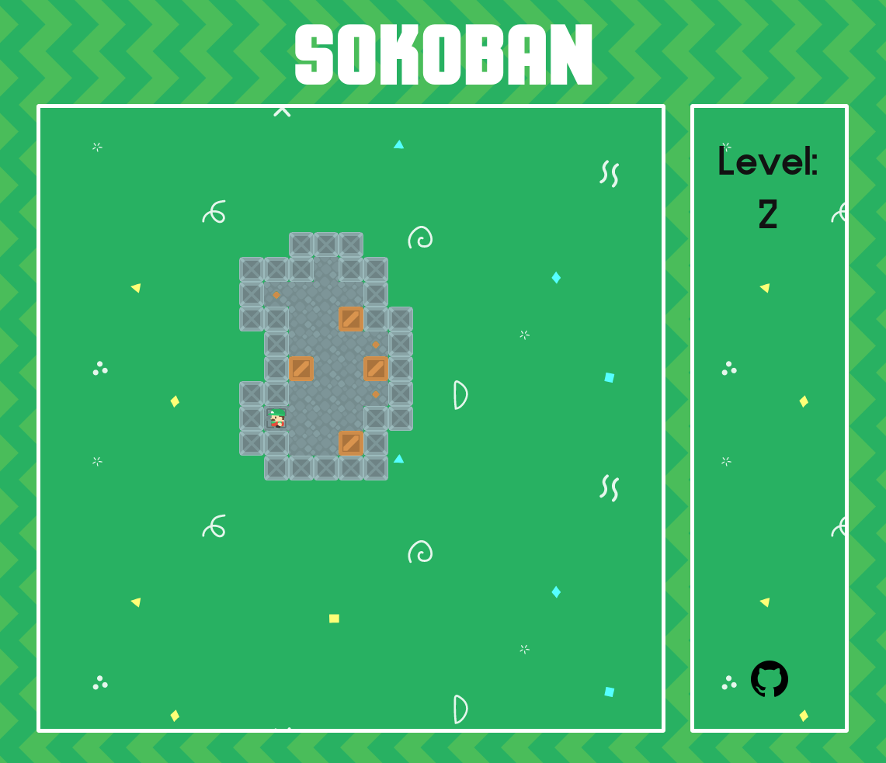

# Play-Sokoban

This is a simple Sokoban game. The goal is to dig Clojurescript a bit, and WebGL 'cause why not.

You can [play it here](https://matthieucneude.com/sokoban).

## Commands

* `Arrow keys` / `hjkl` - Move
* `r` - Restart the level
* `Backspace` - Undo last move

## Disappointments

There are 10 levels, and the game will crash at the end of the 10th. This is a deep allegory about the end of life.

You can't save. You need to do them all in one go.

## Development

If you want to use my masterpiece for whatever you like: 

0. This game is a Clojurescript game only.
1. You need the [Clojure CLI tool](https://clojure.org/guides/deps_and_cli).
2. `clj -A:dev` - Enjoy developing in the browser with live code reloading.
3. `clj -A:prod:play-cljc` - Build a release version to show to the world.

You can't compile the native version. There is no native version.

## Credits

* Tileset: www.kenney.nl
* Game engine: [play-cljc](https://github.com/oakes/play-cljc)

## Licence

[MIT](https://choosealicense.com/licenses/mit/)
